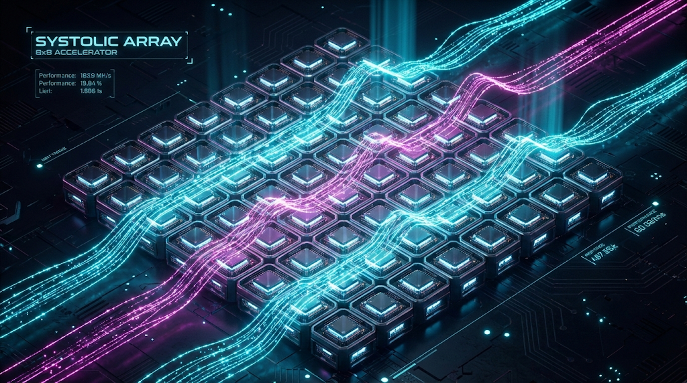

# npu-from-scratch

DE10-Nano(Cyclone V SoC) FPGA 위에서 NPU를 밑바닥부터 설계하는 프로젝트.
<p align="center">
  
</p>

## 로드맵

| 기간 | 단계 | 목표 | 
|------|------|------|
| 2월 | Systolic Array & Linux DMA | 8×8 MAC 어레이 RTL 구현, Linux C/Python 벤치마크 시스템 오프로딩 **[완료]** | 
| 3~4월 | TVM/MLIR 컴파일러 연동 | NPU 컴파일러 코드베이스 경험 및 커스텀 오퍼레이터 매핑 |
| 5~6월 | 하드웨어 고도화 | SRAM 버퍼 크기 증가 및 지원 연산 (Activation, Pooling 등) 확장 설계 |

자세한 내용 → [doc/ROADMAP.md](doc/ROADMAP.md)

## 하드웨어

- **보드:** Terasic DE10-Nano (Intel Cyclone V SoC)
- **FPGA:** Cyclone V SE 5CSEBA6U23I7
- **HPS:** ARM Cortex-A9 Dual-core @ 800MHz
- **베이스 프로젝트:** DE10-Nano SoC GHRD (Golden Hardware Reference Design)

## 프로젝트 구조

```
├── ip/                  # 커스텀 IP
├── nios_software/       # Nios II 소프트웨어
├── linux_software/      # Linux ARM HPS 소프트웨어 (벤치마크)
├── rtl/                 # NPU 하드웨어 로직 (Verilog)
├── sim/                 # Python 베이스 Cocotb 시뮬레이션
├── soc_system.qsys      # Qsys 시스템 설계
└── doc/                 # 문서
```

## 최근 진행 현황 및 핵심 성과

### 1. 8x8 Systolic Array 하드웨어 구조 최적화
- **완전 분리형 파이프라인 (Decoupled Pipeline):** `npu_ctrl.v` (제어), `npu_stream_ctrl.v` (스트리밍), `systolic_core.v` (연산 코어)로 모듈 책임을 완벽히 분리.
- **Backpressure & Stall 완벽 지원:** 하위 MSGDMA에서 `ready=0`으로 Backpressure가 걸려도 데이터가 소실되거나 중복 송신되지 않는 `valid/ready` 핸드쉐이크 및 파이프라인 제어 논리 구축.
- **데이터 중복 출력 (Duplication) 타파:** FSM State 전환 딜레이 및 Data Shift Register FIFO 간의 타이밍 정렬(Alignment)을 완벽하게 맞추어 동일 값이 중복 출력되던 문제를 하드웨어 단에서 근본 해결.

### 2. Avalon-ST (Streaming) 최적화 및 MSGDMA 통합
- **연속 트랜잭션 (Batch Streaming) 블로킹 해결:** Avalon-ST 패킷의 `endofpacket` (EOP) 신호 제어 불량으로 MSGDMA가 한 개의 데이터만 받고 조기 종료되던 버그 수정.
- `REG_SEQ_ROWS` 컨트롤러 레지스터를 도입해, 100개 이상의 다중 행렬 (Batch) 트랜잭션의 제일 마지막 플릿에만 EOP를 정확하게 발생시키도록 수정하여 고속 Direct Memory Access 통신 파이프라인 확립.
- **대역폭 변환:** 256-bit (8x8 한 가로라인) 연산 결과를 64-bit 플릿(Flit) 4개로 쪼개어(Serialization) Avalon-MM 64비트 브리지와 정확히 인터페이싱.

### 3. ARM Cortex-A9 CPU vs FPGA NPU 성능 벤치마크 구축
- **Linux HPS 제어 API (`linux_software/npu_test`):** `/dev/mem`을 통해 AXI Bridge 공간을 Memory-Map(`mmap`)하여, CPU가 직접 캐시를 우회하여 FPGA RAM 영역과 MSGDMA, NPU 컨트롤러를 직접 제어하는 C언어 드라이버 구현.
- **공정한 실측(Speedup) 측정:** 31 배치(Batch) 연속 8x8 행렬 스트리밍 연산을 ARM Cortex-A9 CPU (`gcc -O2` 최적화 3중 for문)와 FPGA 하드웨어 NPU (MSGDMA 오프로드) 상에서 수행하고 `gettimeofday` 단위로 엄밀하게 측정하여 정확성(PASS)과 실행 시간을 비교 검증.
- **성능 측정 결과**: 800MHz 프로세서 대비 **50MHz NPU가 약 3.59배 (3.59x) 더 빠른 실행 속도**를 달성함을 실제 환경에서 확인 완료. (CPU: 133us / NPU: 37us [DMA 오버헤드 포함])
