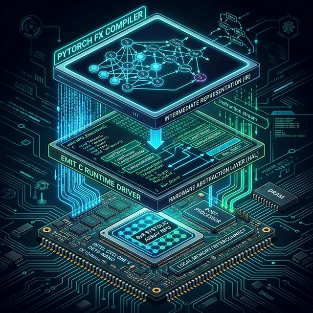
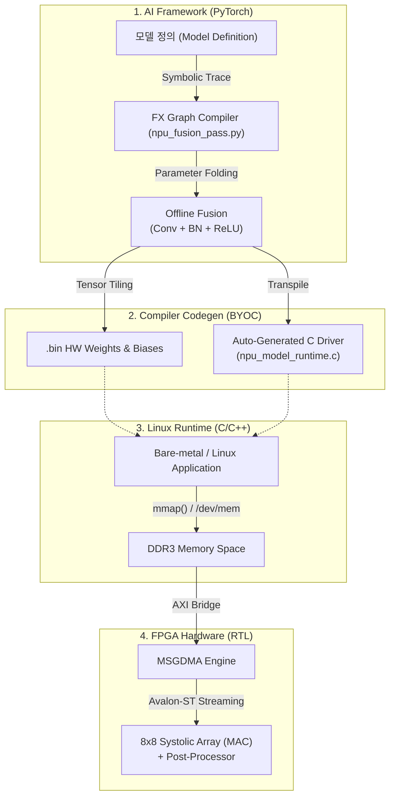

# npu-from-scratch

DE10-Nano (Cyclone V SoC) FPGA 환경에서 NPU를 밑바닥부터 설계한 프로젝트입니다. 8x8 MAC 어레이 기반의 하드웨어 설계부터, Linux Application 통합, 그리고 실제 MNIST 필기체 인식(Inference)까지 End-to-End 시스템을 구현했습니다.

  

## 프로젝트 아키텍처 (Full-Stack Dataflow)

가장 최상단의 딥러닝 리서처 공간(Python)부터, 칩 내부의 실시간 디지털 논리 회로(Verilog)까지 이어지는 전체 파이프라인(Top-Down Processing)은 아래 그림과 같이 동작합니다.

```mermaid
flowchart TD
    subgraph Frontend ["1. AI Framework (PyTorch)"]
        PT["모델 정의 (Model Definition)"]
        FX["FX Graph Compiler (npu_fusion_pass.py)"]
        PT -- Symbolic Trace --> FX
        FX -- Parameter Folding --> Fused["Offline Fusion\n(Conv + BN + ReLU)"]
    end

    subgraph Backend ["2. Compiler Codegen (BYOC)"]
        Fused -- Tensor Tiling --> Bin[".bin HW Weights & Biases"]
        Fused -- Transpile --> EmitC["Auto-Generated C Driver\n(npu_model_runtime.c)"]
    end

    subgraph OS ["3. Linux Runtime (C/C++)"]
        Bin -.-> App["Bare-metal / Linux Application"]
        EmitC -.-> App
        App -- mmap() / /dev/mem --> Mem["DDR3 Memory Space"]
    end

    subgraph Hardware ["4. FPGA Hardware (RTL)"]
        Mem -- AXI Bridge --> DMA["MSGDMA Engine"]
        DMA -- Avalon-ST Streaming --> MAC["8x8 Systolic Array (MAC)\n+ Post-Processor"]
    end
```

## 프로젝트 스코프 (Project Scope)
이 프로젝트의 최종 목표는 단순한 하드웨어 MAC(Multiply-Accumulate) 연산기 설계에 머물지 않습니다. 
상용 AI 가속기와 동일한 **풀스택(Full-Stack) AI 엔지니어링 생태계 모델**을 단독으로 구축하는 것을 스코프로 정의합니다.

1. **AI Framework (Frontend):** PyTorch 모델 설계, QAT(Quantization Aware Training) 및 Operator Fusion(Conv+BN 수학적 병합)
2. **Compiler Codegen (Backend):** 
   - 과거 무거운 외부 스택(TVM/MLIR)에 의존하던 전통적 방식에서 탈피하여, 최신 **PyTorch FX 기반의 100% Python 자체 컴파일러(`npu_fusion_pass.py`)**를 구축했습니다. 
   - 하드웨어 8x8 어레이 구조를 인지하는 타일링(HW-Aware NAS) 패스와 **그래프 기반 순수 C 런타임 드라이버 자동 생성 (Emit C / BYOC)** 기능을 단독으로 수행합니다.
3. **Hardware (RTL):** Pipeline Post-Processor (Bias/Shift/ReLU) 설계와 Avalon-ST 다이렉트 스트리밍을 통한 Zero-Padding 하드웨어 100% 활용도 달성
4. **OS Runtime (C/C++):** 컴파일러가 출력한 가중치 바이너리(`.bin`)를 메모리 매핑(`/dev/mem`, `mmap`)으로 적재하여 NPU를 제어하는 리눅스(Linux) HPS Bare-metal 런타임 환경

## 핵심 성과 (Key Achievements)

*   **하드웨어 가속 달성:** 순수 ARM CPU 연산 대비 NPU + MSGDMA + Hardware Post-Processor 파이프라인을 구축하여 오버헤드를 최소화하고 추론 속도를 대폭 개선했습니다. (CPU 대비 **3.71x Acceleration**, 장당 1.876 ms)
*   **PyTorch Batch-Norm Offline Fusion (정확도 향상):** 기존 순수 NumPy 정수화 모델(89.58%)에서 벗어나, PyTorch 기반 `Linear + BatchNorm1d` 구성으로 전환 후 오프라인 수학적 퓨전(Mathematical Folding)을 적용했습니다. 하드웨어 로직 레이아웃에 단 1Byte의 변경도 주지 않고 극심한 양자화 손실 편차를 극복, **97.92%의 하드웨어 추론 정확도**를 달성했습니다.

### 📊 성능 비교 (Before vs After)
| 지표 | Before (Legacy NumPy 정수화) | After (PyTorch + BN Offline Fusion) | 향상폭 |
| :--- | :--- | :--- | :--- |
| **추론 정확도 (Accuracy)** | 89.58% | **97.92%** | **+ 8.34%p** |
| **추론 속도 (1 Image)** | 6.957 ms (CPU 연산) | **1.876 ms (NPU 가속)** | **3.71배 고속화** |
| **하드웨어 호환성** | 100% 매칭 | **100% 매칭** (스택 구조 변경 없음) | |
*   **Buffer-less Streaming Pipeline:** Avalon-ST 인터페이스의 `valid/ready` 스트리밍 프로토콜을 구현하여, 중간 버퍼(SRAM) 없이 MSGDMA 데이터를 직접 처리하는 효율적인 아키텍처를 설계했습니다.
*   **Full-Stack 시스템 통합 설계:** 시스템 버스 통합(Qsys), Avalon-MM/ST 인터페이스 연결 구조, 그리고 Linux User-space ( `/dev/mem`, `mmap` ) C 드라이버 프로그래밍까지 H/W와 S/W 전반을 직접 구현했습니다.

## 하드웨어 사양
- **보드:** Terasic DE10-Nano (Intel Cyclone V SoC)
- **FPGA:** Cyclone V SE 5CSEBA6U23I7
- **HPS:** ARM Cortex-A9 Dual-core @ 800MHz
- **베이스 프로젝트:** DE10-Nano SoC GHRD (Golden Hardware Reference Design)

## 문서 목차 (Documentation)
상세한 개발 스토리와 아키텍처 다이브(Deep-Dive)는 아래 개별 문서를 참조하십시오.

*   [**TUTORIAL.md**](doc/TUTORIAL.md): MAC 설계부터 MNIST 추론과 H/W 최적화 과정까지를 다루는 **단계별 실전 튜토리얼 (가장 추천)**
*   [**DESIGN_FUSION.md**](doc/DESIGN_FUSION.md): **[NEW]** PyTorch FX 컴파일러부터 내부 하드웨어 파이프라인(SRAM 누적기 및 후처리기)까지 이어지는 Full-Stack Operator Fusion 설계 문서
*   [**RESULT.md**](doc/RESULT.md): CPU vs NPU 성능 검증 및 상세 벤치마크 결과 시트
*   [**DESIGN.md**](doc/DESIGN.md) & [**DESIGN_2ND.md**](doc/DESIGN_2ND.md): 핵심 NPU 계층 구조 및 AXI/Avalon 아키텍처 상세 사양서
*   [**DESIGN_AI.md**](doc/DESIGN_AI.md): NPU 위에서 동작하는 AI 신경망 매핑 및 양자화(Quantization) 구조
*   [**REG_MAP.md**](doc/REG_MAP.md): MSGDMA 및 NPU CSR 플릿 맵
*   [**TESTS.md**](doc/TESTS.md): Python (Cocotb) 기반의 가상 하드웨어 자동 검증 환경
*   [**LESSONS_LEARNED.md**](doc/LESSONS_LEARNED.md): 맨땅에서 설계하며 얻은 트러블슈팅 및 딥 엔지니어링 교훈

## AI 개발 어시스턴트 적용
이 프로젝트는 **H/W-S/W Co-design의 기획 단계부터 최종 구현, 디버깅까지 최신 AI(LLM) 에이전트를 실무형 페어 프로그래머(Pair Programmer)로 적극 활용**했습니다. 수십 시간이 걸리는 검증 코드를 단숨에 생성하거나 버스 인터페이스의 난해한 FSM 타이밍 데드락 버그를 함께 분석하는 등, 거대한 FPGA 하드웨어-소프트웨어 개발 사이클을 기하급수적으로 단축시킨 선도형 개발 사례입니다.
