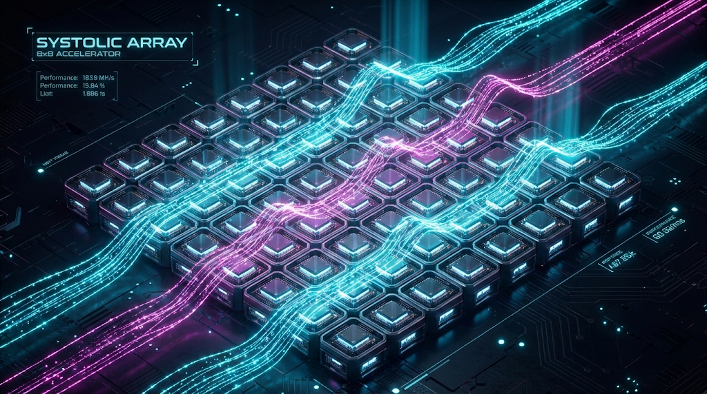

# npu-from-scratch

DE10-Nano (Cyclone V SoC) FPGA 환경에서 NPU를 밑바닥부터 설계한 프로젝트입니다. 8x8 MAC 어레이 기반의 하드웨어 설계부터, Linux Application 통합, 그리고 실제 MNIST 필기체 인식(Inference)까지 End-to-End 시스템을 구현했습니다.

  

## 핵심 성과 (Key Achievements)

*   **하드웨어 가속 달성:** 순수 ARM CPU 연산 대비 NPU + MSGDMA + Hardware Post-Processor (OCM 연동) 파이프라인을 구축하여 오버헤드를 최소화하고 추론 속도를 대폭 개선했습니다 (16.33 ms / img (4.26x Acceleration))
*   **Buffer-less Streaming Pipeline:** Avalon-ST 인터페이스의 `valid/ready` 스트리밍 프로토콜을 구현하여, 중간 버퍼(SRAM) 없이 MSGDMA 데이터를 직접 처리하는 효율적인 아키텍처를 설계했습니다.
*   **Full-Stack 시스템 통합 설계:** 시스템 버스 통합(Qsys), Avalon-MM/ST 인터페이스 연결 구조, 그리고 Linux User-space ( `/dev/mem`, `mmap` ) C 드라이버 프로그래밍까지 H/W와 S/W 전반을 직접 구현했습니다.

## 하드웨어 사양
- **보드:** Terasic DE10-Nano (Intel Cyclone V SoC)
- **FPGA:** Cyclone V SE 5CSEBA6U23I7
- **HPS:** ARM Cortex-A9 Dual-core @ 800MHz
- **베이스 프로젝트:** DE10-Nano SoC GHRD (Golden Hardware Reference Design)

## 문서 목차 (Documentation)
상세한 개발 스토리와 아키텍처 다이브(Deep-Dive)는 아래 개별 문서를 참조하십시오.

*   [**TUTORIAL.md**](doc/TUTORIAL.md): MAC 설계부터 MNIST 추론과 H/W 최적화 과정까지를 다루는 **단계별 실전 튜토리얼 (가장 추천)**
*   [**RESULT.md**](doc/RESULT.md): CPU vs NPU 성능 검증 및 상세 벤치마크 결과 시트
*   [**DESIGN.md**](doc/DESIGN.md) & [**DESIGN_2ND.md**](doc/DESIGN_2ND.md): 핵심 NPU 계층 구조 및 AXI/Avalon 아키텍처 상세 사양서
*   [**DESIGN_AI.md**](doc/DESIGN_AI.md): NPU 위에서 동작하는 AI 신경망 매핑 및 양자화(Quantization) 구조
*   [**REG_MAP.md**](doc/REG_MAP.md): MSGDMA 및 NPU CSR 플릿 맵
*   [**TESTS.md**](doc/TESTS.md): Python (Cocotb) 기반의 가상 하드웨어 자동 검증 환경
*   [**LESSONS_LEARNED.md**](doc/LESSONS_LEARNED.md): 맨땅에서 설계하며 얻은 트러블슈팅 및 딥 엔지니어링 교훈

## AI 개발 어시스턴트 적용
이 프로젝트는 **H/W-S/W Co-design의 기획 단계부터 최종 구현, 디버깅까지 최신 AI(LLM) 에이전트를 실무형 페어 프로그래머(Pair Programmer)로 적극 활용**했습니다. 수십 시간이 걸리는 검증 코드를 단숨에 생성하거나 버스 인터페이스의 난해한 FSM 타이밍 데드락 버그를 함께 분석하는 등, 거대한 FPGA 하드웨어-소프트웨어 개발 사이클을 기하급수적으로 단축시킨 선도형 개발 사례입니다.
