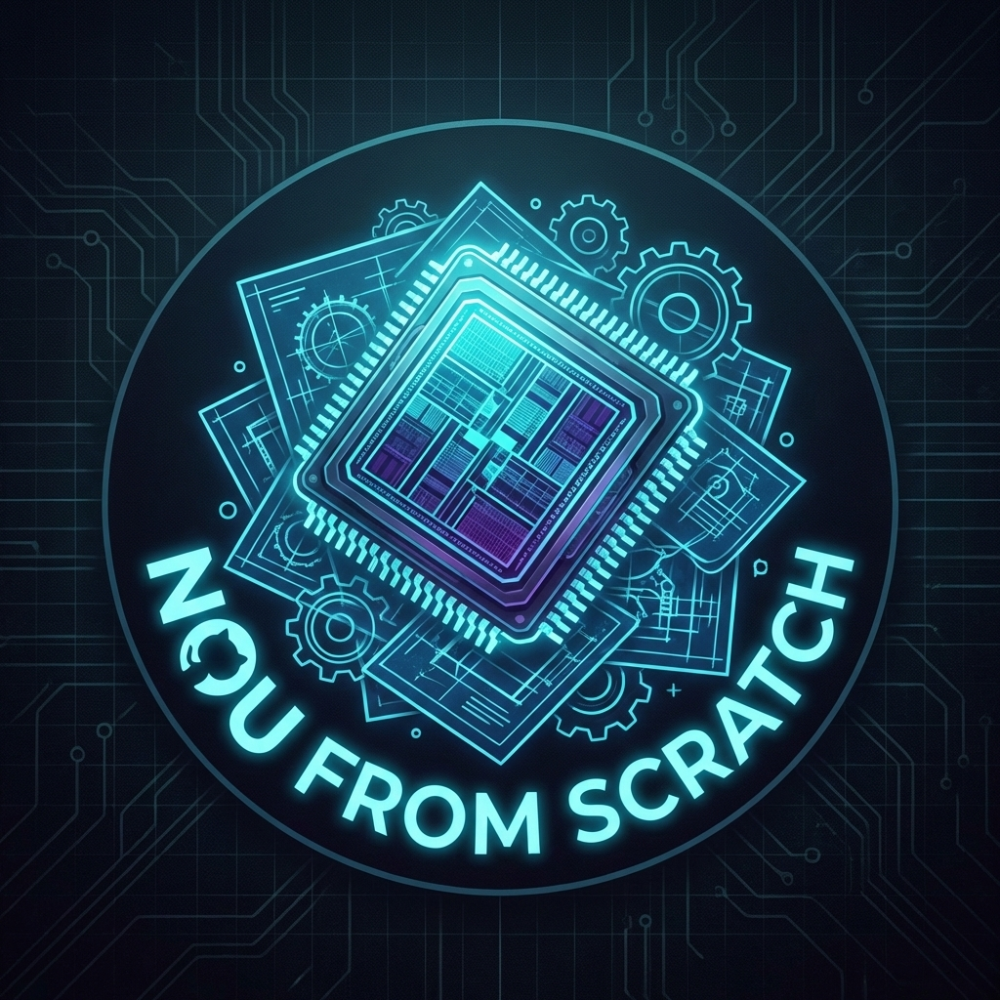

# NPU Architecture Design Document

  

이 문서는 DE10-Nano FPGA 상에 구현된 **Systolic NPU**의 하드웨어 아키텍처와 소프트웨어 제어 설계를 상술합니다.

---

## 1. System Overview

NPU는 ARM HPS (또는 NIOS II 소프트 코어)와 FPGA 간의 **Avalon-MM 브릿지(LWHPS2FPGA)**를 통신망으로 사용하여 연결됩니다. 컨트롤 제어는 Avalon-MM Slave 포트를 통해 `npu_ctrl` 레지스터 맵에 접근하여 수행되고, 대용량 데이터 전송(행렬 가중치 및 입력 맵 데이터)은 **Altera MSGDMA (Message Stream DMA)** IP를 통한 **Avalon-ST (Streaming)** 방식으로 매우 고속으로 오프로드됩니다. 

### 1.1 계층 구조 (Hierarchy)
- **`npu_unit.v`**: NPU 최상단 통합 Wrapper. Avalon-MM 및 Avalon-ST 인터페이스의 I/O 경계선.
  - **`npu_ctrl.v`**: 중앙 컨트롤러. Avalon-MM Slave 제어 레지스터를 파싱하고 FSM과 제어 플래그(`seq_total_rows` 등)를 생성합니다.
  - **`npu_stream_ctrl.v`**: Altera MSGDMA의 Avalon-ST(Source/Sink) 인터페이스와 NPU의 연산 파이프라인(Valid/Ready)을 결합시키는 스트리밍 버퍼 레이어.
  - **`systolic_core.v`**: 핵심 연산 파이프라인 래퍼.
    - `mac_pe.v` 및 `systolic_array.v`: MAC(Multiply-Accumulate) 연산이 매 클럭 연속적으로 발생하는 8x8 하드웨어 엔진.

---

## 2. Hardware Design

### 2.1 Decoupled Avalon-ST Pipeline 
초기 구조에 존재하던 병목 시의 교착 상태(Deadlock)를 하드웨어적으로 방지하기 위해 **데이터 스트림 제어 경로를 연산 경로와 완전히 추상화 분리**했습니다.
- **Backpressure Ready Signal**: NPU 내부 `npu_stream_ctrl.v` 모듈은 MSGDMA Source/Sink 방향 모두에서 `valid`와 `ready` 핸드쉐이크 프로토콜을 아주 엄격하게 준수합니다. 이를 통해 하위 시스템이 바쁠 때(`ready=0`) 데이터의 증발이나 중복 출력을 방지합니다.
- **EOP Batch Streaming**: 한 번에 수많은(예: 100배치) 행렬 데이터를 NPU로 고속 전송할 때 MSGDMA가 조기 종료되지 않도록, 전체 배치의 **마지막 바이트(Row)** 에 도달했을 때만 `endofpacket (EOP)` 스트림 신호가 트리거되도록 `tx_count` 로직을 정밀 구현했습니다.

### 2.2 Systolic Array Pipeline (Skew/Deskew)
연산기(`systolic_core`) 내부 데이터 버스 흐름은 **Systolic** 대각선 진행 방식(맥박처럼 우측 및 하단으로 한 칸씩 Shift)을 완벽 구현했습니다.

  

- **Input Skew Buffer**: 배열 왼쪽으로 들어오는 각 행(Row) 데이터를 0~7 클럭 단위 계단식으로 파이프라인 지연시킵니다. 이 처리를 통해 대각선으로 데이터 웨이브가 맞춰져 올바른 행렬 스칼라곱이 발생합니다.
- **Output Deskew Buffer**: 배열 아래쪽으로 출력되는 Partial Sum 계산 결과를 역방향 계단식 지연을 통해 일렬 종대(Column Vector) 피쳐맵 묶음으로 완벽 정렬해 MSGDMA로 밀어냅니다.

---

## 3. Register Map (Memory-Mapped I/O)

NPU는 32-bit(4바이트) 워드 단위 주소 컨트롤 레지스터를 사용하며, HPS/NIOS에서 C 언어 구조체 포인터(mmap)로 통제합니다.

| Word Offset | Name | Description |
|:--- |:--- |:--- |
| `0x0` | `REG_CTRL` | [1:0] Mode Select (0x3: Load Weight Mode, 0x1: Execution Mode) |
| `0x6` | `REG_SEQ_ROWS`| 수행할 총 데이터 행(Row) 길이. Batch 크기 * 8 로 프로그래밍하여 EOP 트리거 기준 생성. |
| `0x7` | `REG_LATCH_WEIGHT`| 값을 쓰면 Systolic Array 내부 Shift Register에 들어간 가중치를 Weight 연산 레지스터로 최종 Latch시킴 |

> [!NOTE]
> 메모리에서 FPGA로 직접 복사하는 DMA 코드는 NPU 레지스터가 아닌 **Altera MSGDMA CSR & Descriptor Slave IP**를 통해 운영체제가 표준 인터페이스로 관리합니다.

---

## 4. Benchmark Execution Sequence (Linux C)

ARM CPU가 NPU를 호출하고 DMA 벤치마크를 수행하는 과정(`linux_software/npu_test/main.c`)은 다음과 같습니다.

1. `/dev/mem` 메모리 맵핑: FPGA `HPS2FPGA` (0x20000000, 램 영역)와 `LWHPS2FPGA` (0xFF200000, CSR 제어 영역)를 리눅스 가상 메모리 포인터에 바인드.
2. NPU 모드 세팅: `npu_ctrl[0] = 0x3` (Load Weight) 모드로 설정하고 MSGDMA Read 포인터를 통해 가중치 전송.
3. 데이터 Batch 준비: `npu_ctrl[6] = 100 * 8` 로 전송할 전체 행렬의 배치 사이즈를 미리 세팅 (EOP 방어선 구축).
4. 실행 (Execution): `npu_ctrl[0] = 0x1` 구동 모드로 변경한 뒤, DMA Write(결과 수신)을 먼저 준비시키고 DMA Read(입력 송신) 포인터를 스트리밍 인가.
5. `msgdma` CSR의 Busy/Done 플래그를 Polling하며 하드웨어 연산 종료까지 대기.
